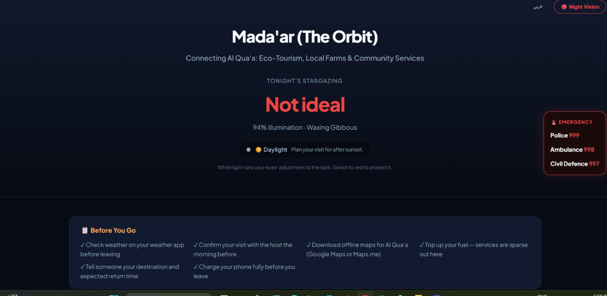
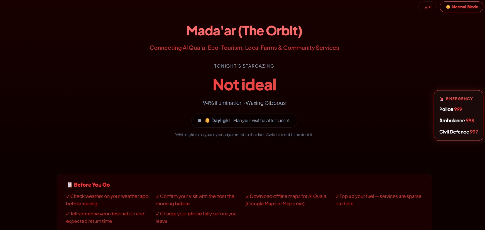
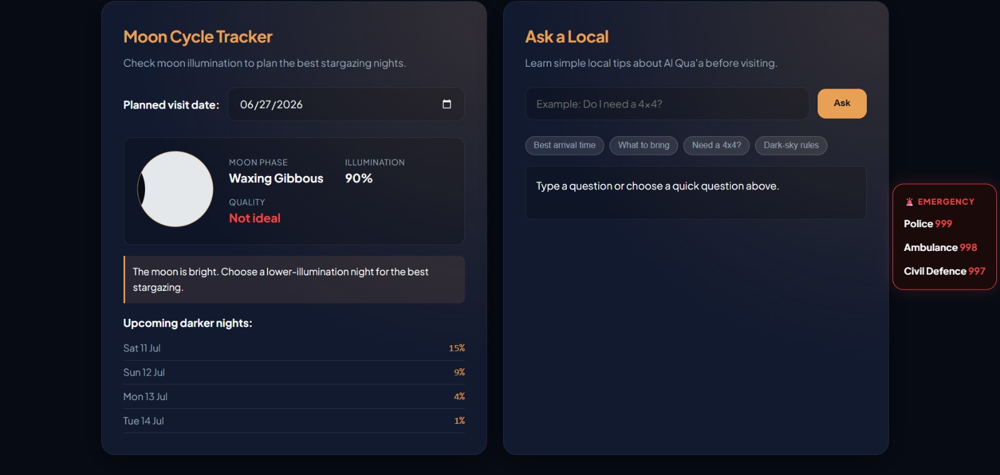
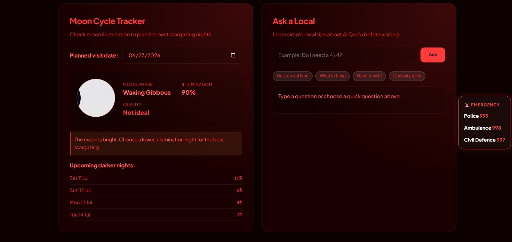
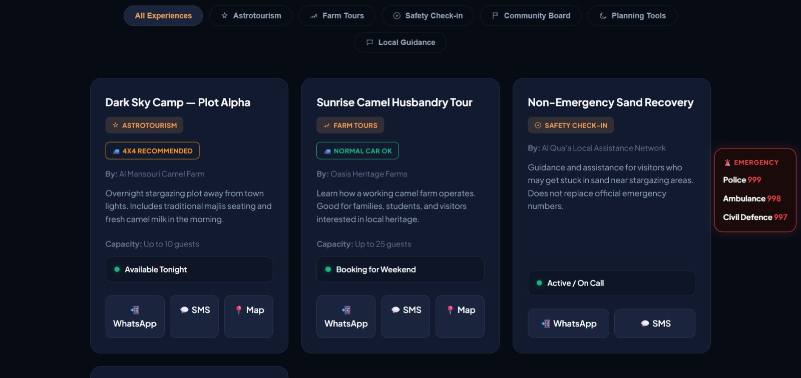
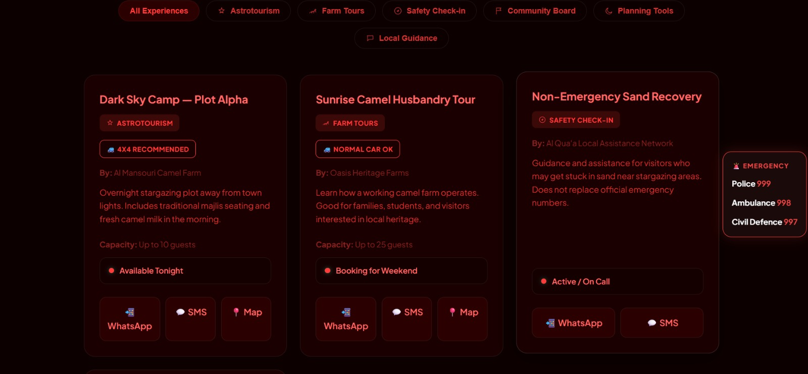
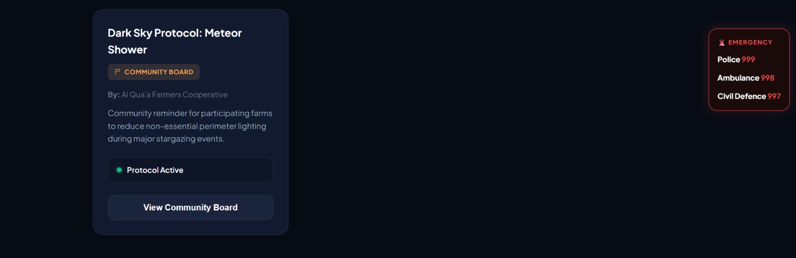
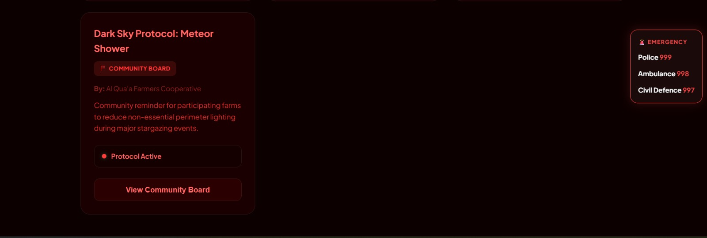

# Mada'ar (مدار) — Al Qua'a Discovery Hub

**Team:** The Fellas  
**Team Members:** Mohamed Elbashir, Mohamed Aymen, Shahmir Khan  
**Hackathon:** Tatweer Hackathon 2026  
**Challenge:** Challenge 4 — Connecting residents to services, opportunities and events  
**Live Website:** https://roadkillgto.github.io/madaar-discovery/  
**Repository:** https://github.com/roadkillgto/madaar-discovery  

---

## Project Summary

**Mada'ar** is an offline-first website that connects visitors with local camel farm experiences, stargazing opportunities, safety guidance, and community services in **Al Qua'a, Al Ain**.

Al Qua'a has two strong local advantages: **camel farms** and **dark desert skies**. Mada'ar connects these strengths by helping visitors discover safe astro-farm experiences while creating new opportunities for local farm owners and residents.

The project is designed to work in rural conditions where internet coverage may be weak. Visitors can load the website before leaving the city, then still access key features offline in the desert.

> Mada'ar is digital for visitors, but simple and human for local residents.

---

## Challenge Chosen

**Challenge 4 — Connecting residents to services, opportunities and events**

Mada'ar fits this challenge by helping residents and local farm owners connect to a new opportunity: safe, community-led stargazing tourism.

The main beneficiary is the local community. Visitors are the channel that brings income, awareness, and activity to local farms and services.

---

## The Problem

Al Qua'a has strong potential for stargazing tourism, but visitors and local residents are not connected in a simple and safe way.

Current problems:

- Visitors may not know where to go for safe stargazing.
- Camel farm owners may have land, hospitality, or local knowledge but no digital presence.
- Visitors may arrive at the wrong time, with the wrong vehicle, or without offline maps.
- Farm owners may not be comfortable using complex apps.
- Mobile data coverage can be unreliable in rural desert areas.
- Bright lights, poor planning, and unsafe access can reduce the stargazing experience.

---

## The Solution

Mada'ar is a lightweight, no-backend, offline-first website that helps visitors:

- Browse local astro-farm experiences
- Check moon illumination before visiting
- Know whether it is dark enough for stargazing
- Ask basic local questions
- Contact hosts by WhatsApp or SMS
- View road access requirements
- Read safety and dark-sky guidance
- Access emergency numbers
- Use night vision mode to protect night-adapted vision

Farm owners do not need to manage the website. A community helper can collect information through WhatsApp, phone call, voice note, or paper card, then add the listing to the website data.

---

## Live Website

Visit the working prototype here:

**https://roadkillgto.github.io/madaar-discovery/**

---

## Screenshots

Screenshots are stored in the `/assets` folder.

| Normal Mode | Night Vision Mode |
|---|---|
|  |  |
|  |  |
|  |  |
|  |  |

---

## Key Features

### 1. Astro-Farm Listings

Visitors can browse local experiences such as:

- Dark sky camping plots
- Camel farm tours
- Community safety support
- Dark-sky community protocols

Each listing includes:

- Provider name
- Description
- Capacity
- Road type
- Availability status
- WhatsApp button
- SMS fallback
- Map link when available

---

### 2. Moon Cycle Tracker

The Moon Cycle Tracker helps visitors choose the best night for stargazing.

It shows:

- Moon phase
- Moon illumination percentage
- Stargazing quality
- Upcoming darker nights

The calculation runs locally in the browser and does not require an external API.

---

### 3. Is It Dark Yet?

The website uses the device clock to estimate whether the sky is currently:

- Daylight
- Sunset
- Civil twilight
- Nautical twilight
- Astronomical dark

This helps visitors understand whether it is currently suitable for stargazing.

---

### 4. Ask a Local

Ask a Local gives simple visitor guidance about Al Qua'a.

Visitors can ask about:

- Best arrival time
- What to bring
- Whether they need a 4x4
- Dark-sky rules
- Farm visit behaviour

This is a static, offline-friendly FAQ system. It does not require AI, internet, or a backend.

---

### 5. Night Vision Mode

Night Vision Mode changes the website into a red-light interface.

This matters because bright white light can reduce night vision during stargazing. Red light is more suitable for night use and helps protect the viewing experience.

---

### 6. Before You Go Checklist

The website includes a practical checklist for visitors before leaving the city:

- Check weather
- Confirm with the host
- Download offline maps
- Fill fuel
- Tell someone the destination
- Charge the phone

---

### 7. Community Board

The Community Board shows local dark-sky protocols, such as reducing non-essential farm lighting during major stargazing events.

This supports both tourism and dark-sky protection.

---

### 8. WhatsApp and SMS Contact

Each listing includes WhatsApp and SMS contact options.

WhatsApp is useful when data is available. SMS is useful when visitors have weak internet but still have mobile network coverage.

---

### 9. Offline-First PWA

Mada'ar uses a service worker to cache the website files after the first load.

After loading once, the website can still work with no internet connection.

This is important for Al Qua'a because desert connectivity can be unreliable.

---

## How It Works

### Visitor Journey

1. Visitor opens Mada'ar before leaving the city.
2. Visitor checks the Moon Cycle Tracker.
3. Visitor checks whether it is dark enough for stargazing.
4. Visitor reads the Before You Go checklist.
5. Visitor browses astro-farm listings.
6. Visitor checks road type and capacity.
7. Visitor contacts the host through WhatsApp or SMS.
8. Visitor uses the website offline if internet is weak.

### Farm Owner Journey

1. Farm owner shares information through WhatsApp, phone call, voice note, or paper card.
2. A community helper collects the listing details.
3. The helper adds the listing to `data.js`.
4. The listing appears on the website.
5. Visitors can discover and contact the host.

This means farm owners do not need to use a complex app or online form.

---

## Technical Approach

Mada'ar is built as a simple static website.

There is:

- No backend
- No database server
- No login system
- No payment system
- No API dependency
- No recurring hosting cost

The website uses:

- HTML
- CSS
- JavaScript modules
- Service worker caching
- Static data stored in `data.js`
- GitHub Pages for hosting

---

## Architecture Decisions

### Offline-first by design

Mada'ar is designed for rural desert conditions. Visitors may lose mobile data after leaving the city, so the website caches key files and works offline after the first load.

### No backend

All listings are stored in `data.js`. This keeps the system simple, low-cost, and easy to maintain.

### Local moon calculation

Moon phase and illumination are calculated directly in the browser using JavaScript. This avoids dependency on external moon APIs.

### Static Ask a Local

Ask a Local uses keyword matching and pre-written local guidance. This avoids AI or internet dependency while still giving useful advice.

### WhatsApp plus SMS

The website supports both WhatsApp and SMS so visitors have a backup contact method when data is weak.

---

## Feasibility

Mada'ar is realistic because it uses tools that are already available and low-cost.

### Prototype Cost

| Item | Estimated Cost |
|---|---:|
| GitHub Pages hosting | 0 AED |
| Static website files | 0 AED |
| Service worker offline caching | 0 AED |
| Canva / screenshots | 0 AED |
| WhatsApp and SMS links | 0 AED |
| Printed host cards | 20 AED |
| **Total Prototype Cost** | **20 AED** |

### Lean Pilot Cost

Assumption: 5 farm hosts and 2 trial stargazing nights.

| Item | Estimated Cost |
|---|---:|
| Host onboarding materials | 100 AED |
| Basic safety signs | 250 AED |
| Low-light markers | 200 AED |
| Waste bags and cleanup supplies | 100 AED |
| Basic first-aid kit | 150 AED |
| Transport coordination | 300 AED |
| **Lean Pilot Total** | **1,100 AED** |

---

## Impact

Mada'ar creates value by:

1. Helping local farm owners access tourism income.
2. Helping visitors find safer stargazing experiences.
3. Supporting dark-sky protection.
4. Making rural tourism easier to organize.
5. Working offline in weak-signal areas.
6. Allowing residents to participate without using complex technology.

---

## Testable Claims

The project makes these testable claims:

1. A visitor can open the live website and browse listings.
2. A visitor can check moon illumination without using an external API.
3. A visitor can use Ask a Local without internet.
4. A visitor can switch to Night Vision Mode.
5. A visitor can contact a host using WhatsApp or SMS.
6. The website can still show core content after being cached.
7. A new farm listing can be added by editing one object in `data.js`.

---

## Validation Plan

| Test | Method | Result |
|---|---|---|
| Website loads | Open GitHub Pages link | Pass |
| Moon tracker works | Select date and view phase/illumination | Pass |
| Ask a Local works | Ask a sample question | Pass |
| Night Vision works | Toggle Night Vision button | Pass |
| Listings filter correctly | Click category buttons | Pass |
| WhatsApp opens | Click WhatsApp button | Pass |
| SMS opens | Click SMS button | Pass |
| Emergency panel visible | Scroll page and check panel | Pass |
| Offline support | Load once, then test after caching | Pass |

---

## Safety Notes

Mada'ar is not an emergency response platform.

It does not replace:

- Police
- Ambulance
- Civil Defence
- Official emergency services

The emergency panel only displays official emergency numbers for quick access.

Visitors should always confirm with hosts before travelling and should not enter farm areas without permission.

---

## Scalability

Mada'ar can scale easily because the system is simple.

To add a new listing, a helper only needs to add a new object to `data.js`.

To adapt Mada'ar to another community, the team can reuse the same files and replace:

- Listings
- Local guidance
- Map links
- Host contacts
- Community protocols
- Language strings

This makes the project reusable for other rural, desert, farm, or eco-tourism communities.

---

## File Structure

```text
index.html         — Main website page
style.css          — Visual design and Night Vision Mode
main.js            — Card rendering, filters, Ask a Local, service worker registration
moon.js            — Moon phase and illumination calculation
data.js            — Listings and local guidance content
config.js          — Categories, icons, and road type labels
utils.js           — Shared helper functions
service-worker.js  — Offline cache strategy
manifest.json      — PWA metadata
README.md          — Project documentation
assets/            — Screenshots and visual evidence
```

---

## Limitations

This is a hackathon MVP, so it has limits:

- It uses sample host data.
- It does not process payments.
- It does not confirm bookings automatically.
- It does not verify real farm hosts yet.
- Moon and twilight calculations are approximate planning tools.
- A real launch would require permission from farm owners and local stakeholders.

---

## Future Improvements

- Add verified real host listings
- Add fully reviewed Arabic translation
- Add “Plan My Visit” recommendation flow
- Add more local experiences and services
- Add seasonal sky content
- Add downloadable host onboarding card
- Add local meal or equipment request feature
- Add school and university trip packages

---

## Demo Video

(https://drive.google.com/file/d/16e1vku2ELnmG-FZEYPhzp1yJ8A02dWeV/view?usp=drive_link)

---

## Team

**Team Name:** The Fellas

**Team Members:**

- Mohamed Elbashir — Engineering feasibility, project planning, and presentation
- Mohamed Aymen — Website prototype, data structure, and user flow
- Shahmir Khan — Documentation, validation, financial plan, and demo video

---

## Final Statement

Mada'ar connects Al Qua'a’s camel farming community with its stargazing potential.

It is not just a tourism website. It is a rural opportunity platform that helps local residents benefit from safe, low-impact stargazing tourism while protecting the dark-sky environment and supporting visitors in a weak-signal rural setting.
